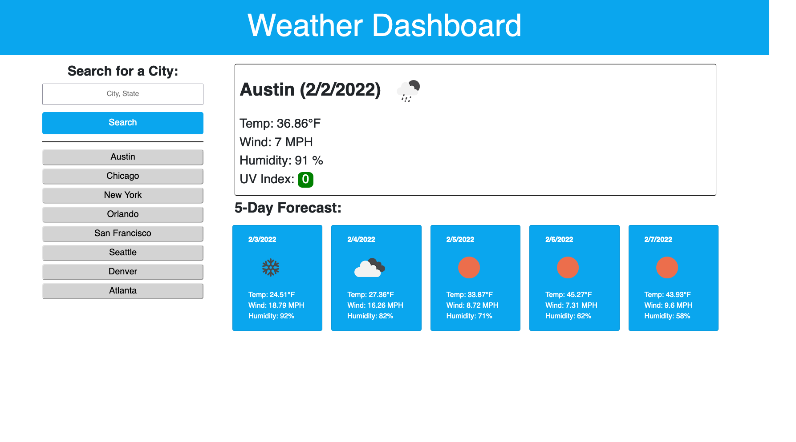

# Weather Dashboard

## Description
This is a Weather Dashboard that allows users to search by city for current and upcoming weather conditions. Details include temperature, wind speed, humidity, and UV index. User’s search history is saved for easy access.

## License

## Deployment
[Deployment Link](https://yyb613.github.io/weather-dashboard)

  
This project is licensed under the MIT License.

For more information on this license, please visit [their website](https://www.mit.edu/~amini/LICENSE.md).

## Contact
If you have any questions, you can find me [here](https://yyb613.github.io/portfolio).
